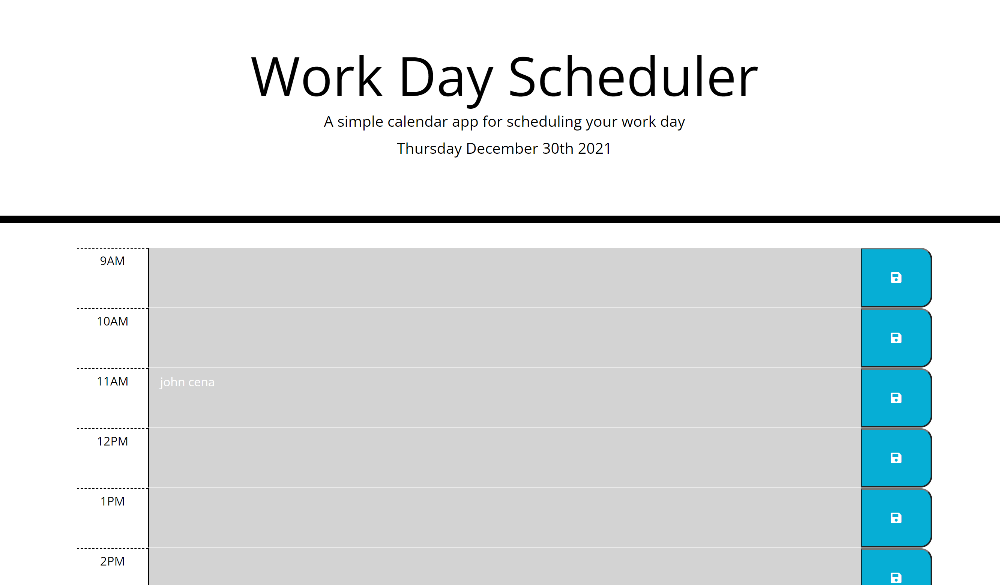

<h1>Work Day scheduler</h1>

<h2>Description</h2>

The purpose of this application was to create a application that would allow for a to-do list that could be closed and reopened at a later time with the text in each work hour remaining upon reloading the page unless purposely deleted

<h2>Screenshot of Application</h2>
<

This application uses css/html/and javascript it also uses the following libraries: jquery/boostrap/moment the use of these libraries allows for very minimal coding all functionality is done through javascript comments found inside will point out what functions affect which features

<h2>Contributors</h2>

Chris McLeod

University of Wisconsin Coding Bootcamp

<h2>Languages used</h2>

css

html

javascript

<h2>Libraries Used</h2>

Moment.js

jquery

bootstrap

<h2>Deployable Link</h2>
https://chris-mcleod2.github.io/WorkDayScheduler/
<h2>Github Link</h2>
https://github.com/Chris-McLeod2/WorkDayScheduler